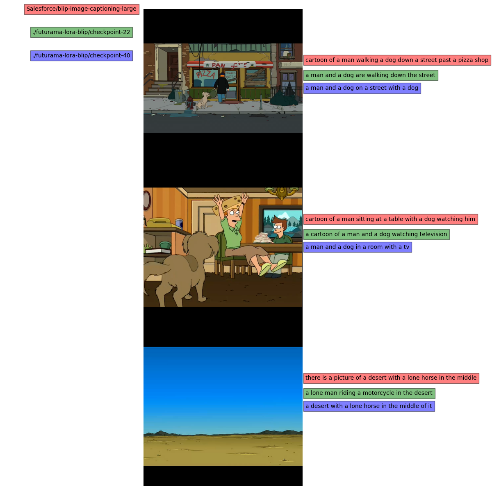

# Lora fine-tuning of blip models

A very simple script to fine-tune hugging-face blip models

## Train script usage 
```
usage: lora_blip_train.py [-h] --dataset_path DATASET_PATH [--model_name MODEL_NAME]
                          [--proccesor_name PROCCESOR_NAME]

Train lora model for image captioning.

optional arguments:
  -h, --help            show this help message and exit
  --dataset_path DATASET_PATH
                        Path to the directory containing the dataset.
  --model_name MODEL_NAME
                        Name of the model to use.
  --proccesor_name PROCCESOR_NAME
                        Name of the proccesor to use.

```
If unspecified, it will start to fine-tune from `Salesforce/blip-image-captioning-large`

You can also update `training_args.yaml` to change training arguments such as learning rate or batch size

## A note on training
Fine-tuning the blip models seems to be a bit hard. I haven't managed to get good results. Maybe tweaking parameters a bit? The dataset for testing this was quite small. 


## Dataset format
The dataset must consist of a folder with the corresponding images and a file `metadata.csv` with at least columns `file_name` and `caption`. You can also update this by modifying the `ImageCaptioningDataset.__getitem__` method. 

## Plotting results
There's also a utility to show some results of caption models to compare them. You only need to provide the dataset from which to draw a couple of samples and the models you want to compare.

```
usage: caption_plot.py [-h] --images_path IMAGES_PATH
                       [--model_names MODEL_NAMES [MODEL_NAMES ...]]

Plot captions for images with different models

optional arguments:
  -h, --help            show this help message and exit
  --images_path IMAGES_PATH
                        Path to the directory containing the images.
  --model_names MODEL_NAMES [MODEL_NAMES ...]
                        Name of the model to use.
```